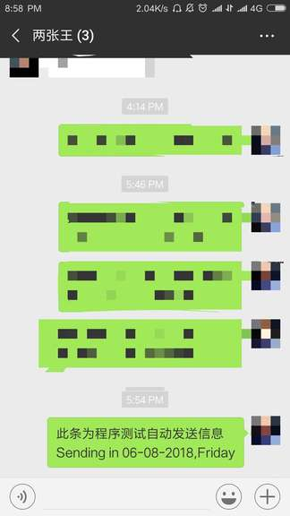
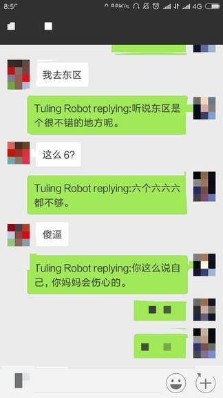

# Introduction

## Designing purpose

Gotta remind our team members to submmit logs on every two days, but I was tired of typing same words for every single time, that's why I decided to write to message sender to help free my hands.

## Files Structure and functions

Code files in this folder include:
  - `schedulerTest.py`
  - `msgSenderOnTimeToChatroom.py`
	- If you want to send your message to specified chatroom in wechat,modify and run this file.
  - `TulingRobot.py`
	- If you want to set auto-reply for your wechat account, modify and run this file.

## Prerequisites

Code are written in *Ubuntu16.04LTS*.
- Python2
- [itchat](https://github.com/littlecodersh/ItChat)
  - BTW, this toolset is super cool and very newbie-friendly, so I do recommend you to design your own fun toys using it.
- Apscheduler

## Usage & Samples

- for `msgSenderOnTimeToChatroom.py`, your PC will send predefined words automatically
  - Run `python msgSenderOnTimeToChatroom.py` in terminal.
  - Scan your QR code to log in.
  - Message got sent like below.

- for `TulingRobot.py`, the robot will take your place to reply your messages
  - Run `python TulingRobot.py` in terminal.
  - Scan QR code to log in.
  - Now the robot will handle your message replying.

## To-do list

- [x] Attach tuling robot in wechat to achieve auto-reply.
- [x] Send predefined message to specified chatroom.
- [ ] Complete sending-on-time function for `msgSenderOnTimeToChatroom.py`.
- [ ] Make robot more intelligent, extented to open music player by sending messages using NeteaseMusic API.
- [ ] Compatile to more file formats like pictures and voice message.
- [ ] **Save the files sent from `filehelper` automatically.**
